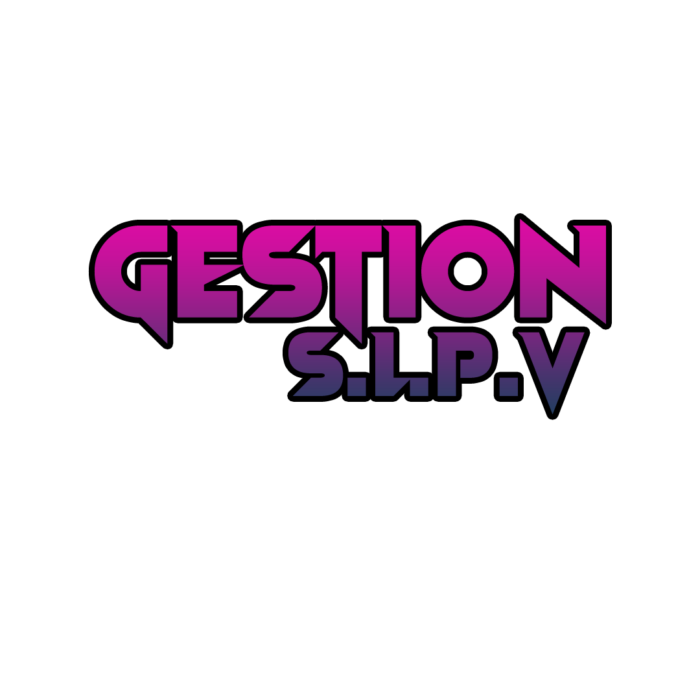
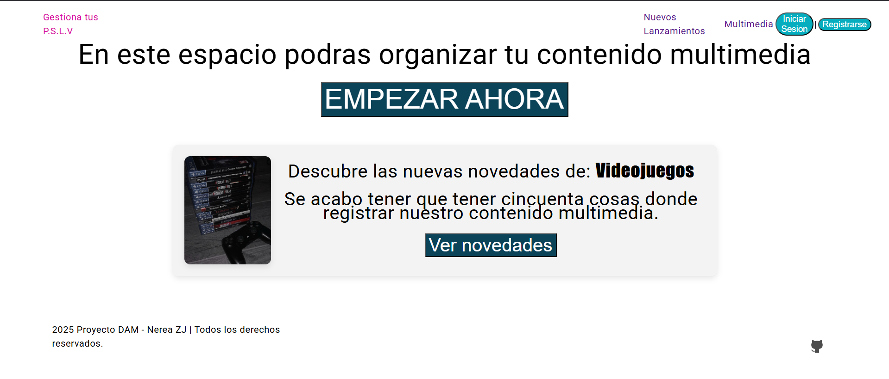

<p align="center">
    
</p>

<br>


## TABLA DE CONTENIDOS

<details open="true">
  
1. [🛠️ Tecnologías Utilizadas](#️-tecnologías-utilizadas)
2. [📌 Descripcion General](#-descripción-general)
4. [💻 Lista de comandos](#-ˏˋ--lista-de-comandos-ˊˎ-)
3. [⚙️ Instalación](#️-instalación)
    - [Prerequisitos](#prerequisitos)
5.  [⚠️ Errores](#-errores)


</details>

<br>

# 🛠️ Tecnologías Utilizadas

[![Angular][angular-bage]][angular-url]
[![Typescript][typescript-badge]][typescript-url] 
[![Supabase][supabase-bage]][supabase-url]
[![Figma][figma-bage]][figma-url]
[![Notion][notion-bage]][notion-url]
[![GitHub][github-bage]][github-url]
[![Power Point][powerpoint-bage]][powerpoint-url]

<br>

# 📌 Decripción General

🚀Proyecto final de FP grado superior desarrollo de aplicaciones multiplataforma (DAM).

Nombre del proyecto: **Gestion P.S.L.V** (_Gestion de Peliculas, Series, Libros y Videos_)

Donde se gestionan los datos multimedia de los usuarios que se registran en la aplicación.

La aplicación está desarrollada en **Angular v18** y **Typescript**, y utiliza **Supabase** como base de datos.


## Captura de pantalla de la aplicación



<br>

# 💻 Lista de comandos

|     | Comando          | Acción                                        |
| :-- | :--------------- | :-------------------------------------------- |
| ⚙️  | `npm install` | Instala las dependencias del proyecto. |
| ⚙️  | `npm install @supabase/supabase-js` | Instala el cliente de Supabase. |
| ⚙️  | `ng add @angular/material` | Instala Angular Material. |
| ⚙️  | `npm start` o `ng serve` | Lanza un servidor de desarrollo local en  `localhost:4200`.  |


<br>

# ⚙ Instalación

<br>

### Prerequisitos

Descargar e instalar [Node.js](https://nodejs.org/es/) y Angular CLI-18 en tu ordenador.

```sh
npm install
# o
npm i
```

```sh
npm install -g @angular/cli@18
```

```sh
npm install @supabase/supabase-js
```
```sh
npm install @angular/material
```


### Instalacion

1. Clona el repositorio
```sh
git clone https://github.com/nereazj544/GestionSPLV_A18_v4.git
```

2. Instala las dependencias
```sh
npm install
# o
npm i
```

3. Inicia el servidor de desarrollo
```sh
ng serve
# O
npm start
```


<br>

# ⚠️ Errores

Si sale este error: ``_An unhandled exception occurred: EBUSY: resource busy or locked, rmdir 'node_modules'._``
<br>
<br>
Para solucionarlo, hay que eliminar la carpeta `.angular` y despues ejecutar el siguiente comando:

```sh
npm start
```
<br>
---


[typescript-url]: https://www.typescriptlang.org/
[typescript-badge]: https://img.shields.io/badge/Typescript-007ACC?style=for-the-badge&logo=typescript&logoColor=white&color=blue

[supabase-bage]: https://img.shields.io/badge/Subapase-007ACC?style=for-the-badge&logo=supabase&logoColor=white&color=green
[supabase-url]: https://www.supabase.com/docs

[angular-bage]: https://img.shields.io/badge/Angular-007ACC?style=for-the-badge&logo=angular&logoColor=white&color=b822d7
[angular-url]: https://v18.angular.dev/

[figma-bage]: https://img.shields.io/badge/Figma-007ACC?style=for-the-badge&logo=figma&logoColor=white&color=FF5733 
[figma-url]: https://www.figma.com/

[notion-bage]: https://img.shields.io/badge/Notion-007ACC?style=for-the-badge&logo=notion&logoColor=white&color=grey 
[notion-url]: https://www.notion.com/es-es/help

[github-bage]: https://img.shields.io/badge/Github-007ACC?style=for-the-badge&logo=github&logoColor=white&color=22aed7 
[github-url]: https://docs.github.com/es

[powerpoint-bage]: https://img.shields.io/badge/Powerpoint-007ACC?style=for-the-badge&logo=microsoftpowerpoint&logoColor=white&color=d76c22
[powerpoint-url]: https://www.microsoft.com/es-es/microsoft-365/powerpoint
